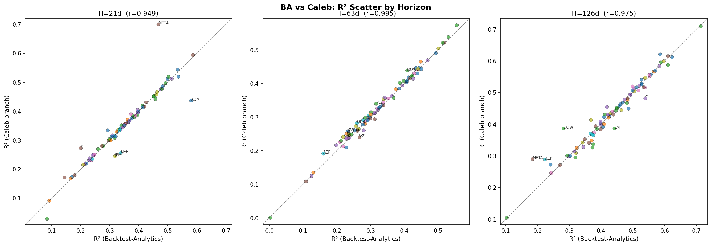
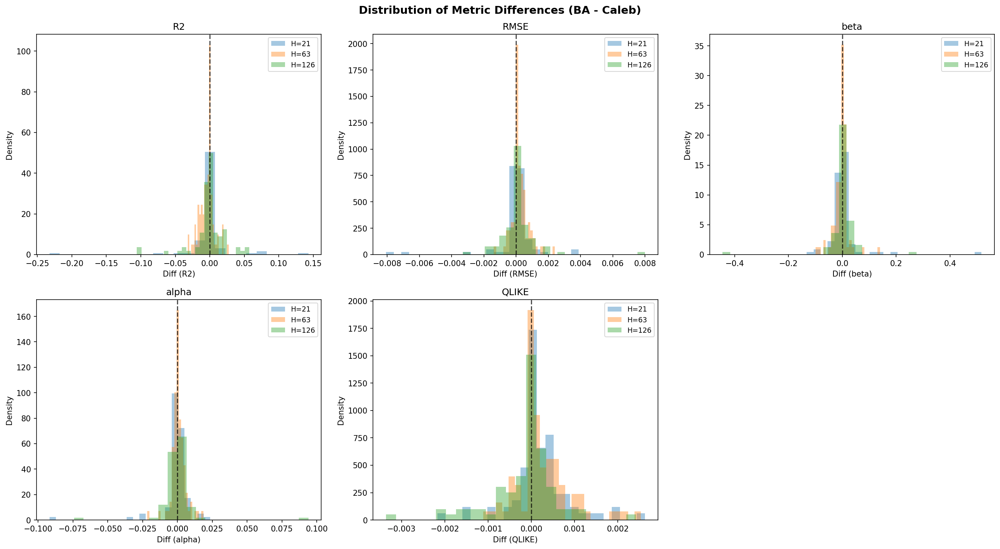
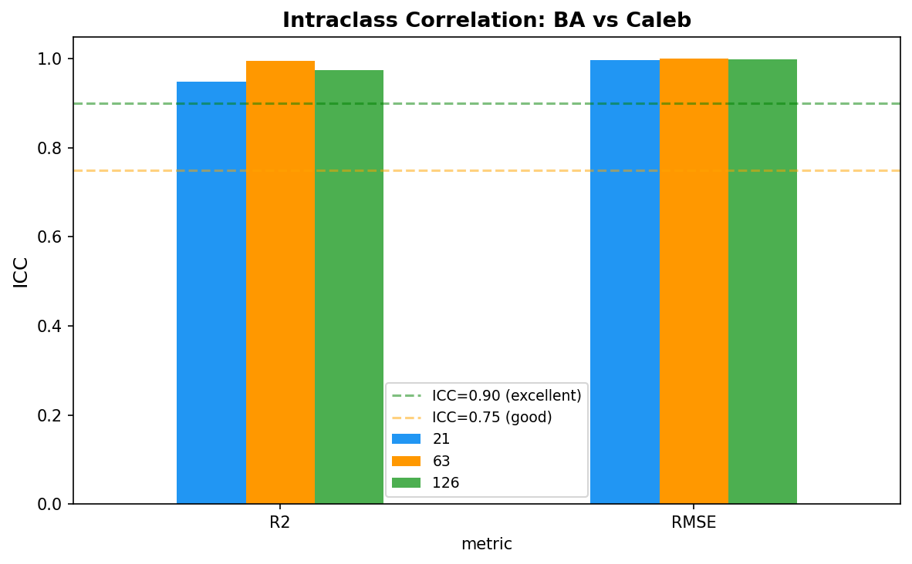

# Cross-Branch Backtest Comparison Report

## Setup
- **Backtest-Analytics (Leo):** 5950X/GTX 1070/Windows — 94 tickers
- **caleb-hardware-backtest-run:** i7-11700K/RTX 3070 Ti/WSL2 — 90 tickers
- **Overlap:** 87 tickers across 3 horizons (259 ticker-horizon pairs)
- **Model code:** Identical at runtime (commit 145908a)

## Reproducibility Verdict: Excellent

All ICC values exceed 0.94 — the pipeline produces highly reproducible results across different hardware.

| Metric | H=21 | H=63 | H=126 |
|--------|------|------|-------|
| ICC (R²) | 0.948 | 0.995 | 0.974 |
| ICC (RMSE) | 0.997 | 1.000 | 0.998 |

## Statistical Differences

| Horizon | Mean R² Diff | Cohen's d | Wilcoxon p | Significant? |
|---------|-------------|-----------|------------|-------------|
| H=21 | -0.002 | -0.05 (negligible) | 0.010 | Technically yes, practically no |
| H=63 | -0.004 | -0.42 (small) | 0.0001 | Yes — small systematic gap |
| H=126 | -0.001 | -0.03 (negligible) | 0.796 | No |

**H=63 finding:** The caleb branch shows R² ~0.004 higher at H=63, consistent across most sectors (Utilities -0.019, RealEstate -0.014, Financials -0.009). Effect size is small (d=-0.42) and practically negligible in absolute terms. Most likely cause: minor data coverage differences — some tickers (notably AAPL) have different date ranges between runs, and H=63 is the horizon most sensitive to walk-forward step alignment.

## Date Range Differences

Most tickers have identical date ranges. Notable exception:
- **AAPL:** BA runs 2013-04-25 to 2024-07-02 (2,816 rows) vs Caleb 2013-11-12 to 2025-10-02 (2,990 rows)
- This suggests different WRDS data pull dates — caleb's pull captured ~6 extra months of recent data

## Sector Patterns

No sector shows consistently large divergence. The largest absolute differences at H=21 are in Comm (driven by RTX outlier) and Energy, but these are within expected RF stochasticity given the small sample sizes per sector.

## Conclusion

The two runs are **statistically equivalent** for practical purposes. The pipeline is reproducible across hardware, and RF stochasticity introduces only minor noise (ICC > 0.95 everywhere). The H=63 systematic gap is real but tiny (~0.4% R²) and attributable to data coverage differences rather than model instability.

**Recommendation:** Either result set can serve as the canonical baseline. The caleb branch has slightly more recent data for some tickers, making it marginally preferable if freshness matters.

## Plots
- 
- 
- 
