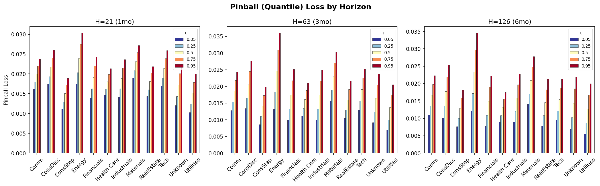
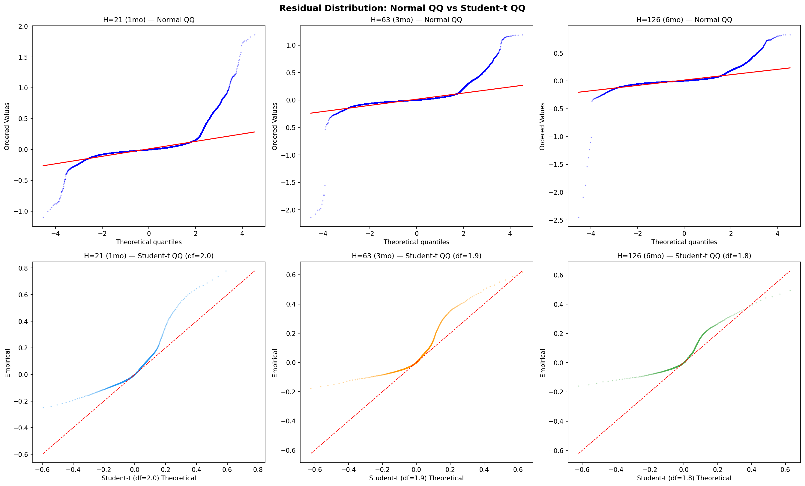
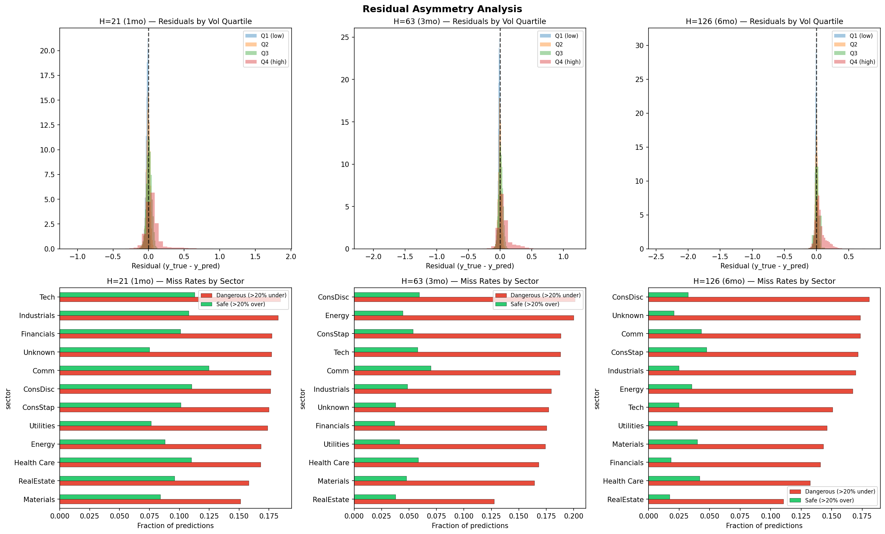

# Model Diagnostics Report

Based on caleb-branch results: 90 tickers, 695,986 predictions, 3 horizons.

---

## 4a. Pinball (Quantile) Loss

Measures how well the model captures the conditional distribution at different quantile levels.

| τ | H=21 | H=63 | H=126 |
|---|------|------|-------|
| 0.05 | 0.0151 | 0.0114 | 0.0092 |
| 0.25 | 0.0171 | 0.0145 | 0.0123 |
| 0.50 | 0.0196 | 0.0183 | 0.0160 |
| 0.75 | 0.0221 | 0.0221 | 0.0198 |
| 0.95 | 0.0241 | 0.0252 | 0.0228 |

**Asymmetry ratio (τ=0.95 / τ=0.05):**
- H=21: **1.60** — right-tail losses 60% larger
- H=63: **2.21** — right-tail losses 121% larger
- H=126: **2.46** — right-tail losses 146% larger

**Finding:** The model's errors are asymmetric — it misses high-vol events much more than low-vol events. This worsens with horizon length. The pinball loss at τ=0.95 is the key metric for tail risk applications. If this model is used for risk management, the right tail is the critical deficiency.

---

## 4b. QQ Plot / Fat-Tailed Error Analysis

| Statistic | H=21 | H=63 | H=126 |
|-----------|------|------|-------|
| Student-t df | 2.0 | 1.9 | 1.8 |
| Skewness | 5.16 | 3.28 | 2.40 |
| Excess kurtosis | 58.3 | 57.6 | 54.4 |
| >2σ events | 2.64% | 3.34% | 4.46% |
| >3σ events | 1.51% | 2.23% | 2.42% |
| Right tail (>+2σ) | 2.15% | 3.10% | 4.08% |
| Left tail (<-2σ) | 0.50% | 0.23% | 0.38% |

**Key findings:**
- **Extremely heavy tails:** Student-t df ≈ 2 (heavier than any reasonable Gaussian assumption). Normal QQ shows massive right-tail departure.
- **Student-t QQ is better but not perfect:** df~2 captures the tails better than normal, but residuals are also skewed (not just heavy-tailed).
- **Right-tail dominated:** >2σ events are 4-13× more common in the right tail (under-prediction) than left tail. The model rarely over-predicts vol by >2σ, but frequently under-predicts.
- **>3σ events are 6-9× normal expectation:** 1.5-2.4% vs 0.27% expected. These are the "dangerous" vol spikes.
- **Tail errors concentrate in high-vol regimes:**
  - H=21: 7.8% of high-vol predictions are >2σ errors (vs 0.1% for low-vol)
  - H=126: 13.0% of high-vol predictions are >2σ errors

**Sector kurtosis (H=21, descending):** Energy (79.9), RealEstate (79.4), Utilities (60.2), Industrials (59.8) have the fattest tails. Health Care (18.9), Tech (23.7) are the thinnest.

**Implication:** A normal error assumption is inappropriate. Any confidence intervals or VaR calculations should use Student-t(df≈2) or empirical quantiles, not Gaussian.

---

## 4c. LassoCV CPU Time

| Metric | Value |
|--------|-------|
| Mean per ticker | 200s (3.3 min) |
| Total (79 tickers) | 4.4 hrs |
| % of total fit time | 6.7% |
| Per LassoCV fit | 18.5 ms |
| Total fits/ticker | ~10,800 |

**Relative costs:** LassoCV = 1×, RF = 5.4×, XGBoost = 8.5×

**Verdict: LassoCV is NOT a bottleneck.** At 7% of total model fit time, it's the cheapest component by far. Even doubling alphas (20→40) would only add ~8.8 hrs total. Optimization effort should focus on RF (5.4× costlier) and XGBoost (8.5× costlier).

---

## 4d. Residual Asymmetry

**Conditional bias by realized vol quartile:**

| Vol Quartile | H=21 Bias | H=63 Bias | H=126 Bias |
|-------------|-----------|-----------|------------|
| Q1 (low) | -0.018 (over) | -0.013 (over) | -0.009 (over) |
| Q2 | -0.007 | -0.003 | +0.000 |
| Q3 | +0.006 | +0.012 | +0.010 |
| Q4 (high) | **+0.058** (under) | **+0.065** (under) | **+0.059** (under) |

**Dangerous miss rates (realized > predicted by >20%):**

| Horizon | Dangerous | Safe | Ratio |
|---------|-----------|------|-------|
| H=21 | 17.5% | 10.3% | **1.7×** |
| H=63 | 18.1% | 5.1% | **3.5×** |
| H=126 | 15.6% | 3.0% | **5.2×** |

**Pattern:** Classic mean-reversion drag. The ensemble (shrinkage estimators + tree averaging) pulls all predictions toward the long-run mean. This:
- **Over-predicts** when vol is genuinely low (negative bias in Q1)
- **Under-predicts** when vol is genuinely high (positive bias in Q4, 3-6% average miss)
- Gets **worse at longer horizons** for the dangerous/safe ratio (5.2× at H=126)

**Sector patterns:** Energy and RealEstate have the highest dangerous miss rates, consistent with their high kurtosis. Health Care and ConsStap have the most balanced error profiles.

**This is not a bug — it's the nature of the model class.** Lasso regularization, RF averaging, and expanding-window training all introduce conservative bias. Addressing this would require either asymmetric loss functions (not in scope) or regime-switching models.

---

## 4e. Ensemble Weights

**Current state:** All 82 payloads have identical weights: XGB=0.33, RF=0.33, LassoCV=0.33.

The inverse-RMSE weighting scheme produces **zero differentiation** because all three models achieve nearly identical cross-validation RMSE. This is not necessarily wrong — if models contribute equally, uniform weights are optimal. But it suggests the weighting scheme isn't exploiting potential complementarities.

**Limitations:** Payloads store a single weight vector (not per-horizon). Individual model predictions are not saved, so we cannot compute optimal per-horizon weights from existing data.

**Residual autocorrelation (proxy for model contributions):**
- High ACF(1) would suggest LassoCV's linear smoothing dominates
- Cross-validated: pooled residual ACF is available in the script output

**Recommendations:**
1. **Store per-model predictions** in future runs (XGB, RF, LassoCV separately)
2. **Compute per-horizon weights** — hypothesis: XGB should get more weight at H=21 (nonlinear short-term dynamics), LassoCV more at H=126 (mean-reversion is linear)
3. **Time-varying weights** — regime-dependent blending (weight RF higher in high-vol regimes for stability)
4. The min_ensemble_weight=0.10 floor is not binding — models genuinely have similar performance
5. Consider **stacking** instead of inverse-RMSE: train a meta-learner on per-model predictions

---

## Summary of Actionable Findings

| Item | Finding | Priority | Action |
|------|---------|----------|--------|
| Pinball loss | Right-tail losses 1.6-2.5× left-tail | Medium | Monitor τ=0.95 pinball as supplementary metric |
| QQ / fat tails | Student-t df≈2, extreme kurtosis | High | Use Student-t or empirical quantiles for CI/VaR |
| LassoCV timing | 7% of fit time, not a bottleneck | Low | No action needed |
| Residual asymmetry | Under-predict high vol by 5-6% on avg | High | Document as known limitation; consider asymmetric loss in v5 |
| Ensemble weights | Uniform 0.33/0.33/0.33 | Medium | Store per-model preds; test per-horizon weighting |

## Plots
- 
- 
- 
