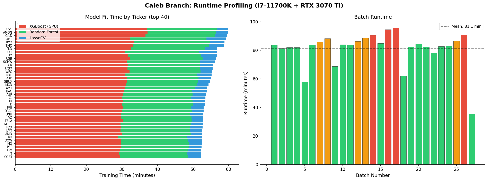
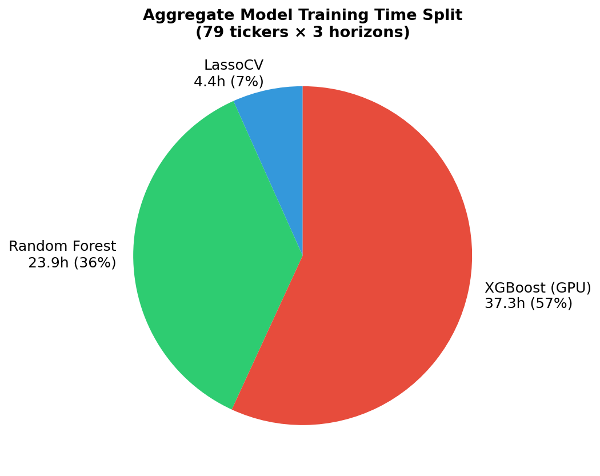
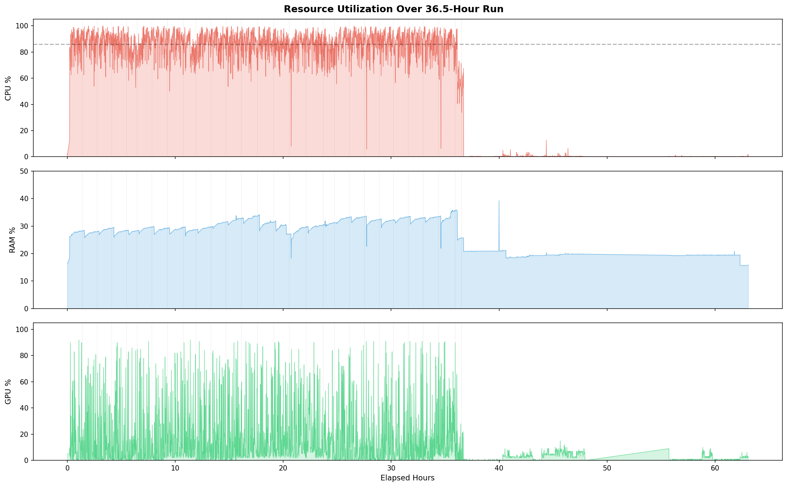

# Runtime Analysis & Speed Optimization Report

## Hardware Profiles

| | Caleb (measured) | Leo (estimated) |
|---|---|---|
| CPU | i7-11700K (8C/16T) | 5950X (16C/32T) |
| GPU | RTX 3070 Ti (6,144 CUDA) | GTX 1070 (1,920 CUDA) |
| RAM | 15.5 GB | Unknown |
| OS | Windows WSL2 | Windows |
| Runtime | 36.5 hrs | ~overnight (est. 10-15 hrs) |

## Where Time is Spent (Caleb Branch, 79 Tickers)

| Component | Total Hours | % of Fit Time | Per-Ticker Mean |
|-----------|------------|---------------|-----------------|
| XGBoost (GPU) | 37.3h | 57% | 28.3 min |
| Random Forest | 23.9h | 36% | 18.2 min |
| LassoCV | 4.4h | 7% | 3.3 min |
| **Total model fit** | **65.6h** | **100%** | **49.8 min** |

Note: 65.6h of model fit time compressed into 36.5h wall-clock via 3-ticker parallelism.

**Overhead:** ~31 min per batch (38% of wall-clock) goes to data loading, feature computation, and I/O — a significant and optimizable fraction.

## Resource Utilization (Active Period)

| Resource | Mean | Median | P95 | Max |
|----------|------|--------|-----|-----|
| CPU | 86% | 88% | 98% | 100% |
| RAM | 30% | 30% | 33% | 36% |
| GPU | 18% | 9% | 72% | 92% |
| VRAM | 2.0 GB | 2.0 GB | 2.7 GB | 3.2 GB |

**Key findings:**
- **CPU is the bottleneck** — saturated at 86% mean, 98% at P95
- **RAM has massive headroom** — only 30% used, ~10 GB free
- **GPU is idle 38% of the time** — only active during XGBoost tree building
- **VRAM barely touched** — 2 GB of 8 GB used (75% headroom)

## Why Leo's 5950X Was Faster

Amdahl's law estimate: RF+LassoCV (43% of fit time) scale with cores. With 2× threads (32 vs 16), theoretical speedup = **1.27×** → estimated 28.6 hrs. But Leo's run was likely 10-15 hrs (2.4-3.6×), suggesting:

1. **More aggressive parallelism** — 5950X can run more tickers per batch without core contention
2. **Better memory bandwidth** — Zen 3 dual-CCD architecture
3. **GPU difference is a wash** — GTX 1070 is weaker but small datasets don't fully utilize either GPU
4. **Possibly different batch size** — Leo may have used larger batches

## Optimization Recommendations (Ranked by Impact)

### Tier 1: High Impact (combined ~50% reduction)

**1. cuML Random Forest on GPU** — Est. saving: 7-11 hrs
- RF is 36% of fit time, all on CPU
- RAPIDS cuML RF is 5-10× faster on GPU for this data size
- RTX 3070 Ti has 6,144 CUDA cores sitting idle during RF fits
- Install: `pip install cuml-cu12` or via conda `mamba install -c rapidsai cuml`
- Code change: `from cuml.ensemble import RandomForestRegressor` (API-compatible with sklearn)
- **This is the single highest-impact change**

**2. Arch Linux native** — Est. saving: 4-6 hrs
- WSL2 overhead: 5-15% CPU penalty + severe I/O penalty on `/mnt/c/` paths
- NTFS via 9P protocol: random reads ~10× slower than ext4
- Clone repo to ext4 partition, install NVIDIA drivers + CUDA
- Profiling toolkit: `perf stat/record`, `py-spy`, `nvtop`, `flamegraph`
- Resource control: `taskset` for CPU pinning, `cgroups`, `nice`/`ionice`
- **Setup cost:** ~2 hours to configure Arch with CUDA + Python env

**3. Parallelism tuning** — Est. saving: 4-7 hrs
- Current: 3 tickers/batch, each model uses `n_jobs=-1` (all 16 threads)
- Problem: 3 × 16 = 48 threads competing for 16 threads → context switching overhead
- Fix: `n_jobs=4` per model × 4 tickers/batch = 16 threads, no contention
- RAM allows it: 30% → ~40% with 4 tickers
- On 5950X: `n_jobs=8` × 4 tickers = 32 threads (perfect match)

### Tier 2: Medium Impact

**4. Feature matrix caching** — Est. saving: 2-4 hrs
- 31 min/batch overhead includes redundant feature computation
- Pre-compute full feature matrix once per ticker → cache as parquet
- Walk-forward steps slice the cached matrix (no recomputation)

**5. Data path optimization** — Est. saving: 1-2 hrs
- Move `data_cache/` from `/mnt/c/` to WSL's native ext4 (`/home/houzi/data_cache/`)
- Symlink back if needed
- 9P protocol overhead on `/mnt/c/` adds latency to every parquet read

### Tier 3: Investigation Needed

**6. XGBoost CPU vs GPU** — Potentially saves or costs time
- 3K rows × 36 features is small for GPU
- GPU kernel launch overhead may exceed compute savings
- Profile both: `tree_method="hist"` with and without `device="cuda"`
- If CPU is faster, save GPU for cuML RF

## Combined Projections

| Scenario | Estimated Runtime | Speedup |
|----------|------------------|---------|
| Current (i7-11700K, WSL2) | 36.5 hrs | 1.0× |
| + cuML RF only | 26-29 hrs | 1.3× |
| + Arch Linux | 22-25 hrs | 1.5× |
| + Parallelism tuning | 19-22 hrs | 1.7× |
| All optimizations (i7-11700K) | ~20 hrs | 1.8× |
| All optimizations (5950X) | ~12-16 hrs | 2.3-3× |

## Plots
- 
- 
- 
